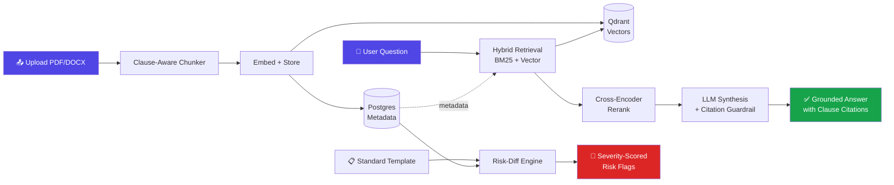

<div align="center">

# 🔍 ClauseIQ

### RAG-Powered Contract & Document Intelligence Platform

*Ask your contracts questions. Get answers with exact clause citations. Catch risky clauses before they catch you.*

<br/>


<br/>

[Features](#-features) • [Architecture](#-architecture) • [Tech Stack](#-tech-stack) • [Getting Started](#-getting-started) • [Roadmap](#-roadmap) • [Team](#-team)

</div>

---

## 🧩 The Problem

Legal and business teams burn hours manually reading contracts to answer simple questions:

> *"What's our termination liability?"*
> *"Which clauses differ from our standard template?"*
> *"Are there auto-renewal traps hiding in here?"*

**ClauseIQ** ingests contracts (PDF/DOCX), lets you ask natural-language questions across one or many documents, and returns answers **grounded in exact clause citations** — plus an automated risk-flagging pass comparing every upload against your standard template.

Built for small businesses, freelancers, startup founders signing vendor contracts, and legal-ops teams without in-house counsel for every review.

---

## ✨ Features

| | |
|---|---|
| 📄 **Multi-format ingestion** | Upload PDF or DOCX contracts, auto-parsed into clause-level chunks |
| 💬 **Natural-language Q&A** | Ask questions across one or many documents at once |
| 🎯 **Exact citation grounding** | Every answer links back to the precise clause — click to jump straight to it in the PDF |
| ⚖️ **Risk-diffing engine** | New uploads are automatically compared against your standard template, with severity-scored flags |
| 🔎 **Hybrid retrieval** | BM25 + vector search + cross-encoder reranking — production-grade RAG, not "chat with your PDF" |
| 🏢 **Multi-tenant ready** | Org/workspace model built in from day one |
| 🛡️ **Anti-hallucination guardrail** | Ungrounded answers are rejected before they reach you |

---

## 🏗️ Architecture



### How it works

**Ingestion pipeline:** Upload → parse into clauses/sections → chunk with clause-level metadata (type, section number) → embed → store vectors + metadata → mark document "ready."

**Query pipeline:** Question → hybrid retrieval (BM25 + vector) over relevant docs → cross-encoder rerank → LLM synthesizes an answer *only* from retrieved chunks, forced to cite chunk IDs → frontend maps citations back to exact PDF locations for click-to-highlight.

**Risk-diffing:** Maintain one standard template per contract type → new uploads get matched clause-by-clause → LLM flags additions, deletions, and changed obligations with a severity score.

---

## 🛠️ Tech Stack

<table>
<tr>
<td valign="top" width="50%">

**Backend**
- FastAPI + Celery (async ingestion)
- PostgreSQL — documents/users/orgs metadata
- Qdrant — vector storage
- BM25 + cross-encoder reranker — hybrid retrieval
- Claude API — grounded answer synthesis

</td>
<td valign="top" width="50%">

**Frontend**
- Next.js (React) + TailwindCSS
- PDF.js — inline clause highlighting
- Clerk / Auth0 — multi-tenant auth

</td>
</tr>
<tr>
<td valign="top">

**Infra**
- Docker Compose (local dev)
- Vercel (frontend deploy)
- Railway / Render (backend deploy)

</td>
<td valign="top">

**Embeddings**
- `bge-large` (open-source, zero API cost in dev)
- Swappable for OpenAI / Voyage / Cohere

</td>
</tr>
</table>

---

## 🚀 Getting Started

### Prerequisites
- [Docker Desktop](https://www.docker.com/products/docker-desktop/)
- Python 3.11+
- Node.js 18+

### 1️⃣ Clone & start infrastructure

```bash
git clone https://github.com/MayankHenry/ClauseIQ.git
cd ClauseIQ
docker compose up -d
```

This brings up **Postgres** (`localhost:5434`), **Qdrant** (`localhost:6333`), and **Redis** (`localhost:6380`).

### 2️⃣ Backend setup

```bash
cd backend
python3 -m venv venv

# Windows
.\venv\Scripts\Activate.ps1
# macOS/Linux
source venv/bin/activate

pip install -r requirements.txt
alembic upgrade head
uvicorn app.main:app --reload
```

### 3️⃣ Verify it's alive

```bash
curl http://localhost:8000/health
# {"status": "ok"}

curl http://localhost:6333/collections
# {"result":{"collections":[]}, "status":"ok"}
```

### 4️⃣ Frontend (coming Week 2)

```bash
cd frontend
npm install
npm run dev
```

<details>
<summary>📁 <b>Project structure</b></summary>

```
clauseiq/
├── docker-compose.yml
├── backend/
│   ├── app/
│   │   ├── main.py
│   │   ├── api/
│   │   ├── core/
│   │   │   └── config.py      # centralized settings
│   │   ├── db/
│   │   │   └── session.py     # SQLAlchemy engine + session
│   │   ├── models/
│   │   │   └── db.py          # orgs, documents, clauses, clause_embeddings, queries, risk_flags
│   │   ├── services/
│   │   │   ├── parsers.py     # PDF/DOCX/TXT -> raw text
│   │   │   ├── chunker.py     # clause-aware chunking
│   │   │   ├── embeddings.py  # bge-small/bge-large embedding wrapper
│   │   │   ├── vector_store.py # Qdrant client wrapper
│   │   │   └── ingestion_core.py
│   │   └── workers/
│   │       ├── celery_app.py
│   │       └── ingestion.py   # full ingestion pipeline task
│   ├── migrations/             # Alembic
│   ├── tests/
│   └── requirements.txt
├── scripts/
│   └── seed_and_ingest.py     # local end-to-end pipeline test
└── frontend/                   # Next.js app
```

</details>

---

## 🔌 Port Allocations

This machine runs several local projects side by side (SentinelOps, FrameSentinel, a Nexus stack, Airflow) — Docker ports collide silently and just fail to bind rather than raising an obvious error, so here's what ClauseIQ actually uses and why:

| Service | Port | Note |
|---|---|---|
| Postgres | `5434` | Moved off `5432` (taken by `nexus_db`) and then off `5433` (taken by `sentinelops-postgres`) |
| Qdrant | `6333` / `6334` | Free on this machine so far |
| Redis | `6380` | Moved off `6379` (taken by `sentinelops-redis`) |

⚠️ **If a container silently fails to start** (`docker ps` shows fewer containers than expected, or you get a `password authentication failed` error even with correct credentials), it's almost always one of two things:

1. **Port collision** — another local project's container already owns that port. Check with `docker ps` and look for the port already in the `PORTS` column of a different container.
2. **Stale volume** — Postgres only applies `POSTGRES_USER`/`POSTGRES_PASSWORD` on first init. If the named volume (`pgdata`) already existed from a previous run, new credentials in `docker-compose.yml` are silently ignored. Fix with `docker compose down -v` (wipes the volume) then `docker compose up -d` + re-run migrations.

Before starting a **new** portfolio project on this machine, run `docker ps` first and pick free ports deliberately rather than trusting the defaults in a tutorial's `docker-compose.yml`.

---


## 🗺️ Roadmap

<details open>
<summary><b>Week 1 — Ingestion + Retrieval Core</b></summary>

- [x] Repo, Docker Compose (Postgres + Qdrant), schema migrated
- [ ] Clause-aware chunker
- [ ] Embedding + ingestion pipeline
- [ ] Upload API + status tracking
- [ ] Hybrid retrieval (BM25 + vector)
- [ ] Cross-encoder reranker

</details>

<details>
<summary><b>Week 2 — Synthesis, Risk-Diffing, Frontend, Ship</b></summary>

- [ ] Citation-grounded answer synthesis
- [ ] Query API + eval logging
- [ ] Risk-diffing engine
- [ ] Frontend: upload + document list
- [ ] Frontend: chat + citation highlighting
- [ ] Frontend: risk-diff dashboard + auth
- [ ] Deploy + polish

</details>

---

## 🧪 Why This Isn't Just "Chat With Your PDF"

| Tutorial RAG | ClauseIQ |
|---|---|
| Fixed-window chunking | **Clause-aware chunking** — splits by legal structure, not token count |
| Pure vector similarity | **Hybrid search** (BM25 + vector) + cross-encoder reranking |
| Answers with no proof | **Forced citation grounding** — ungrounded answers are rejected |
| Single-doc toy | **Multi-tenant, multi-document** from day one |
| No risk awareness | **Automated risk-diffing** against your own standard templates |

---

## 👥 Team

**Team 85** — Dell FutureMinds AI Hackathon 2026

| Name | Role |
|---|---|
| Mayank | Backend / Infra |
| Naitik | — |
| Radhika | Frontend |
| Henry | AI/ML + RAG Pipeline |

---

## 📜 License

MIT — see [LICENSE](LICENSE) for details.

<div align="center">

<br/>

**⭐ Star this repo if ClauseIQ helped you avoid signing a bad contract.**

</div>