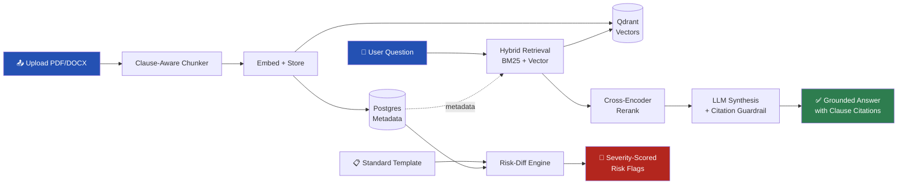

<div align="center">

# 🔍 ClauseIQ

### RAG-Powered Contract & Document Intelligence Platform

*Ask your contracts questions. Get answers with exact clause citations. Catch risky clauses before they catch you.*

<br/>


<br/>

[Features](#-features) • [Architecture](#-architecture) • [Tech Stack](#-tech-stack) • [Getting Started](#-getting-started) • [Deployment](#-deployment) • [Testing](#-testing)

</div>

---

## 🧩 The Problem

Legal and business teams burn hours manually reading contracts to answer simple questions:

> *"What's our termination liability?"*
> *"Which clauses differ from our standard template?"*
> *"Are there auto-renewal traps hiding in here?"*

**ClauseIQ** ingests contracts (PDF/DOCX), lets you ask natural-language questions across one or many documents, and returns answers **grounded in exact clause citations** — plus an automated risk-flagging pass comparing every upload against your standard template.

Built for small businesses, freelancers, startup founders signing vendor contracts, and legal-ops teams without in-house counsel for every review.

---

## ✨ Features

| | |
|---|---|
| 📄 **Multi-format ingestion** | Upload PDF or DOCX contracts, auto-parsed into clause-level chunks |
| 💬 **Natural-language Q&A** | Ask questions across one or many documents at once |
| 🎯 **Exact citation grounding** | Every answer links back to the precise clause. Ungrounded or hallucinated citations are rejected, not surfaced |
| ⚖️ **Risk-diffing engine** | New uploads are compared against your standard template, clause by clause, with severity-scored flags |
| 🔎 **Hybrid retrieval** | BM25 + vector search + cross-encoder reranking |
| 🖊️ **Margin-rail risk review** | A dedicated dashboard for reviewing flagged clauses, ranked by severity |
| 🔐 **Bare-bones auth** | Shared-password JWT gate on all mutating actions |
| 🏢 **Multi-tenant-ready schema** | Org/workspace model built into the data layer from day one |

---

## 🏗️ Architecture


```mermaid
flowchart LR
    A[📤 Upload PDF/DOCX] --> B[Clause-Aware Chunker]
    B --> C[Embed + Store]
    C --> D[(Qdrant<br/>Vectors)]
    C --> E[(Postgres<br/>Metadata)]

    F[💬 User Question] --> G[Hybrid Retrieval<br/>BM25 + Vector]
    G --> D
    G --> H[Cross-Encoder<br/>Rerank]
    H --> I[LLM Synthesis<br/>+ Citation Guardrail]
    I --> J[✅ Grounded Answer<br/>with Clause Citations]

    E -.metadata.-> G

    K[📋 Standard Template] --> L[Risk-Diff Engine]
    E --> L
    L --> M[🚩 Severity-Scored<br/>Risk Flags]

    style A fill:#2451B3,color:#fff
    style F fill:#2451B3,color:#fff
    style J fill:#2E7D4F,color:#fff
    style M fill:#B3261E,color:#fff
```

### How it works

**Ingestion pipeline:** Upload → parse into clauses/sections → chunk with clause-level metadata (type, section number) → embed → store vectors + metadata → mark document "ready."

**Query pipeline:** Question → hybrid retrieval (BM25 + vector) over relevant docs → cross-encoder rerank → LLM synthesizes an answer *only* from retrieved chunks, forced to cite chunk IDs → any citation not traceable to a real clause causes the answer to be marked ungrounded rather than trusted.

**Risk-diffing:** Maintain one standard template per contract type → new uploads get matched clause-by-clause (by clause type) → LLM flags missing clauses and substantive differences with a severity score, fails safe (flags for manual review) if its response can't be parsed.

---

## 🛠️ Tech Stack

<table>
<tr>
<td valign="top" width="50%">

**Backend**
- FastAPI + Celery (async ingestion)
- PostgreSQL — documents/users/orgs/risk-flags metadata
- Qdrant — vector storage
- BM25 + cross-encoder reranker — hybrid retrieval
- Claude API — grounded answer synthesis + risk comparison
- PyJWT — bare-bones auth

</td>
<td valign="top">

**Frontend**
- Next.js 14 (App Router) + TypeScript + TailwindCSS
- PDF.js — inline PDF preview with page-jump on citation click
- Custom design system (see below) — no default component library

</td>
</tr>
<tr>
<td valign="top">

**Infra**
- Docker Compose (local dev — Postgres, Qdrant, Redis)
- Vercel (frontend deploy)
- Railway / Render (backend + worker deploy)

</td>
<td valign="top">

**Embeddings**
- `bge-small` (open-source, zero API cost in dev)
- Swappable to `bge-large` via one config value

</td>
</tr>
</table>

---

## 🎨 Design system

The frontend deliberately avoids the generic-AI-tool look (warm cream + terracotta, or dark mode + neon accent). Instead it borrows from the actual subject matter — how a lawyer marks up a paper contract:

- **Palette**: cool paper white background, near-navy ink, a restrained "filed" blue for interactive elements. Red/amber/green only ever mean risk severity — never decoration.
- **Type**: Source Serif 4 for structure (headings, section labels), IBM Plex Sans for interface text, IBM Plex Mono for clause IDs, section numbers, and severity scores — numbers read as data, not prose.
- **Signature element**: the **margin rail** on the risk-review page — a vertical annotation rail with one tick per flagged clause, colored by severity, echoing a redlined margin. Only flagged clauses get a tick, same as a real margin: nobody annotates the boilerplate that's fine.

---

## 🚀 Getting Started

### Prerequisites
- [Docker Desktop](https://www.docker.com/products/docker-desktop/)
- Python 3.11+
- Node.js 18+
- An [Anthropic API key](https://console.anthropic.com) (free trial credits available, no card required)

### 1️⃣ Clone & start infrastructure

```bash
git clone https://github.com/MayankHenry/ClauseIQ.git
cd ClauseIQ
docker compose up -d
```

This brings up **Postgres**, **Qdrant**, and **Redis**. Check ports match your `docker-compose.yml` — this project moved Postgres/Redis off their defaults during development to avoid clashing with other local projects (see [Port Allocations](#-port-allocations) below).

### 2️⃣ Backend setup

```bash
cd backend
python3 -m venv venv

# Windows
.\venv\Scripts\Activate.ps1
# macOS/Linux
source venv/bin/activate

pip install -r requirements.txt
cp .env.example .env   # then fill in ANTHROPIC_API_KEY at minimum
alembic upgrade head
uvicorn app.main:app --reload
```

**In a second terminal**, start the Celery worker (required for uploads to actually process):
```bash
cd backend
celery -A app.workers.celery_app worker --loglevel=info --pool=solo   # --pool=solo is Windows-only
```

### 3️⃣ Frontend setup

```bash
cd frontend
npm install
cp .env.local.example .env.local
npm run dev
```

Open `http://localhost:3000`.

### 4️⃣ Verify

```bash
curl http://localhost:8000/health
# {"status": "ok"}
```

<details>
<summary>📁 <b>Project structure</b></summary>

```
clauseiq/
├── docker-compose.yml
├── backend/
│   ├── Dockerfile
│   ├── Procfile / railway.json
│   ├── app/
│   │   ├── main.py
│   │   ├── api/          # documents, search, query, risk, auth
│   │   ├── core/          # config, auth
│   │   ├── db/             # session, bootstrap
│   │   ├── models/       # orgs, documents, clauses, clause_embeddings, queries, risk_flags
│   │   ├── services/     # parsers, chunker, embeddings, vector_store,
│   │   │                    retrieval, reranker, synthesis, risk_diff
│   │   └── workers/       # Celery ingestion pipeline
│   ├── migrations/         # Alembic
│   └── tests/
├── frontend/
│   ├── app/                 # /, /chat, /risk, /risk/[id], /login
│   ├── components/
│   └── lib/                 # api client, auth, severity helpers
└── scripts/                 # local test/eval scripts
```

</details>

---

## 🔌 Port Allocations

This machine runs several local projects side by side — Docker ports collide silently and just fail to bind, so here's what ClauseIQ actually uses:

| Service | Port | Note |
|---|---|---|
| Postgres | `5434` | Moved off `5432`/`5433` to avoid conflicts with other local projects |
| Qdrant | `6333` / `6334` | |
| Redis | `6380` | Moved off `6379` for the same reason |

⚠️ If a container silently fails to start, it's almost always a **port collision** (check `docker ps` for the port already in use elsewhere) or a **stale volume** (Postgres only applies `POSTGRES_PASSWORD` on first init — fix with `docker compose down -v` then `docker compose up -d`, then re-run migrations).

---

## ☁️ Deployment

**Frontend → Vercel**
```bash
cd frontend
vercel deploy
```
Set `NEXT_PUBLIC_API_URL` to your deployed backend URL in Vercel's environment variables.

**Backend → Railway / Render**
- `railway.json` and `Procfile` are both included — most platforms auto-detect one
- Set all variables from `.env.example` in your platform's dashboard, **especially `APP_PASSWORD` and `APP_SECRET_KEY`** — without them, auth silently becomes a no-op (fine for local dev, not for anything public)
- Deploy the Celery worker as a **second service** using the same image/repo, with the worker start command instead of the web one
- Point `DATABASE_URL`, `QDRANT_URL`, and `REDIS_URL` at managed instances (Railway/Render Postgres and Redis add-ons, or a hosted Qdrant Cloud cluster)

A `Dockerfile` is included for platforms that prefer container-based deploys over buildpacks.

---

## 🧪 Testing

```bash
cd backend
pytest tests/ -v
```

30 tests across the pipeline: clause-aware chunking, ingestion logic, hybrid retrieval scoring, reranking, citation-grounded synthesis (including the anti-hallucination guardrail), risk-diffing (including fail-safe behavior on malformed LLM output), and auth. All mock external services (embeddings, Qdrant, Claude) via dependency injection, so the suite runs in under a second with no infrastructure required.

```bash
cd frontend
npx tsc --noEmit
npm run build
```

---

## 🧪 Why This Isn't Just "Chat With Your PDF"

| Tutorial RAG | ClauseIQ |
|---|---|
| Fixed-window chunking | **Clause-aware chunking** — splits by legal structure, not token count |
| Pure vector similarity | **Hybrid search** (BM25 + vector) + cross-encoder reranking |
| Answers with no proof | **Forced citation grounding** — ungrounded answers are rejected |
| Single-doc toy | **Multi-tenant-ready, multi-document** from day one |
| No risk awareness | **Automated risk-diffing** against your own standard templates |
| Generic dashboard UI | **Purpose-built design system**, not a default component kit |

---

## ⚠️ Known Limitations

- **Citation click jumps to page, not exact position.** `Clause.bbox` exists in the schema but isn't populated during ingestion — pixel-perfect highlighting is a natural next step, not implemented yet.
- **Auth is single-shared-password, not multi-user.** Real per-user accounts (Clerk/Auth0) were the planned upgrade path if this became a real product; out of scope for the current timeline.
- **BM25 index rebuilds per query** rather than persisting — fine at hundreds/thousands of clauses, would need a persistent inverted index at real scale.

---

## 👥 Team

**Team 85** — Dell FutureMinds AI Hackathon 2026

| Name | Role |
|---|---|
| Mayank | Backend / Infra |
| Naitik | — |
| Radhika | Frontend |
| Henry | AI/ML + RAG Pipeline |

---

## 📜 License

MIT — see [LICENSE](LICENSE) for details.

<div align="center">
<br/>

**⭐ Star this repo if ClauseIQ helped you avoid signing a bad contract.**

</div>
