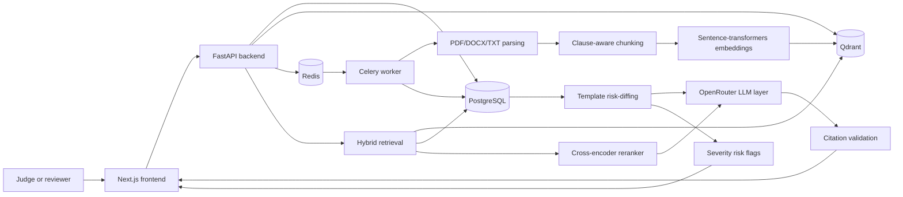

# ClauseIQ

ClauseIQ is a contract-review workspace for asking questions about uploaded agreements and seeing the clauses behind each answer. It is designed for the practical review work that happens before a contract is signed: finding important terms, comparing an agreement with a standard template, and deciding which differences deserve human attention.

## 1. Problem

Contract review is often a slow search problem. Someone has to read a long agreement, find the termination, liability, renewal, payment, confidentiality, and indemnification language, and then explain the answer to someone else. The work becomes harder when several contracts need to be compared with a preferred standard template. Even when a reviewer finds an answer, it is useful to be able to prove exactly where that answer came from.

ClauseIQ focuses on reducing that search and comparison burden without pretending to replace legal judgment.

## 2. Solution

The user journey is:

```text
Upload PDF/DOCX/TXT
  -> parse the document
  -> split it into clause-aware chunks
  -> create embeddings and store them with metadata
  -> retrieve with lexical and semantic search
  -> rerank the best candidates
  -> ask the LLM for a grounded response
  -> validate clause citations
  -> review template differences and risk flags
```

Uploads are saved and queued for asynchronous ingestion. PDF text is parsed page by page; DOCX and TXT files are normalized as document text. The chunker uses legal structure and clause types rather than treating the document as arbitrary fixed windows. Embeddings are stored in Qdrant, while document and clause metadata is stored in PostgreSQL.

For a question, ClauseIQ combines BM25 lexical scores with vector similarity, then applies a cross-encoder reranker. The LLM receives the selected clause context and must attach inline clause citations. The backend checks that cited IDs were present in that context; missing or invalid citations are marked ungrounded.

For risk review, one ready document can be marked as the standard template for a contract type. A later document is compared by clause type. Missing template clauses and substantive differences are persisted as risk flags with a severity score and description.

## 3. Key Features

- **PDF, DOCX, and TXT ingestion:** the upload API accepts these formats, with a 25 MB file limit.
- **Natural-language contract Q&A:** ask a question about one document or search across available documents.
- **Multi-document search:** the query API accepts optional document IDs and otherwise searches the available clause set.
- **Clause-level citation grounding:** responses include cited clause text and metadata, with a backend grounding check.
- **Hybrid retrieval and reranking:** BM25 and vector retrieval are combined before cross-encoder reranking.
- **Template risk-diffing:** mark a ready document as a template, then compare another document of the same contract type.
- **Severity-based risk flags:** missing and changed clauses are displayed with severity values and descriptions.
- **Shared-password JWT authentication:** mutating actions such as upload, template selection, and risk-diffing can require a JWT issued by the login endpoint.
- **PDF preview and citation navigation:** the frontend can display an uploaded PDF and jump to the cited page. Exact text or bounding-box highlighting is not implemented.
- **Organization-linked data model:** documents and queries carry an organization relationship in PostgreSQL, while the current application uses a default organization rather than full user and tenant administration.

## 4. Why ClauseIQ Is Different

| Traditional/manual review | ClauseIQ |
|---|---|
| Search through every page manually | Ask a natural-language question |
| Split text into generic windows | Preserve clause and section structure during chunking |
| Give an answer without a source trail | Return clause citations and validate their IDs |
| Compare agreements by reading them side by side | Compare clauses against a designated standard template |
| Use only one search signal | Combine BM25 lexical search, vector search, and reranking |

These are workflow improvements, not a claim that automated output replaces professional contract review.

## 5. System Architecture



Redis is the Celery broker/backend for ingestion. The question path runs retrieval, reranking, and synthesis through FastAPI. LLM calls use the OpenAI-compatible client configured with OpenRouter.

## 6. Tech Stack

**Frontend**

- Next.js 14 App Router
- React 18 and TypeScript
- Tailwind CSS
- `pdfjs-dist` for the inline PDF viewer

**Backend**

- Python 3.11+
- FastAPI and Uvicorn
- SQLAlchemy and Alembic
- Celery and Redis for asynchronous ingestion
- `pdfplumber` and `python-docx` for parsing

**AI/ML**

- Sentence Transformers embeddings using `BAAI/bge-small-en-v1.5` by default
- BM25 via `rank_bm25`
- Cross-encoder reranking with `cross-encoder/ms-marco-MiniLM-L-6-v2`
- OpenRouter through the OpenAI-compatible Python client for answer synthesis and risk comparison

**Data/Storage**

- PostgreSQL for documents, clauses, queries, organizations, templates, and risk flags
- Qdrant for vector points and clause metadata
- Local file storage for uploaded source documents

**Infrastructure/Deployment**

- Docker Compose for local PostgreSQL, Qdrant, and Redis
- Vercel for the frontend
- Render for the deployed backend
- A separate Celery worker is required for queued upload processing

**Authentication**

- PyJWT with an HS256 token
- One shared password configured through `APP_PASSWORD`

## 7. Deployment

**Frontend: Vercel**  
https://clause-iq-1.vercel.app

**Backend: Render**  
https://clauseiq-backend-lqbg.onrender.com

The deployed frontend points to the backend through `NEXT_PUBLIC_API_URL`. Hosting-platform environment variables supply the database, Redis, Qdrant, OpenRouter, and authentication settings. Secrets are intentionally not included in the submission ZIP.

The confirmed supporting infrastructure is PostgreSQL, Redis, Qdrant, a Celery worker, and OpenRouter. The backend repository also contains a Dockerfile, Procfile, and Railway configuration, but the live links above are the submission deployment targets.

## 8. How To Run Locally

Prerequisites: Docker Desktop, Python 3.11+, Node.js 18+, and an OpenRouter API key.

1. **Clone the repository.**

   ```powershell
   git clone https://github.com/MayankHenry/ClauseIQ.git
   cd ClauseIQ
   ```

2. **Start infrastructure.**

   ```powershell
   docker compose up -d
   ```

   This starts PostgreSQL on `5434`, Qdrant on `6333`, and Redis on `6380`.

3. **Set up the backend.**

   ```powershell
   cd backend
   python -m venv venv
   .\venv\Scripts\Activate.ps1
   pip install -r requirements.txt
   Copy-Item .env.example .env
   ```

   Edit `.env` locally with placeholders such as:

   ```dotenv
   OPENROUTER_API_KEY=your_openrouter_api_key_here
   APP_PASSWORD=your_app_password_here
   APP_SECRET_KEY=your_secret_key_here
   ```

   Keep connection settings aligned with `docker-compose.yml`.

4. **Run the database migration.**

   ```powershell
   alembic upgrade head
   ```

5. **Start FastAPI in the first backend terminal.**

   ```powershell
   uvicorn app.main:app --reload --port 8000
   ```

6. **Start the Celery worker in a second backend terminal.**

   ```powershell
   .\venv\Scripts\Activate.ps1
   celery -A app.workers.celery_app worker --loglevel=info --pool=solo
   ```

7. **Start the Next.js frontend in a third terminal.** Override the checked-in script's port so it does not collide with FastAPI.

   ```powershell
   cd frontend
   npm install
   $env:NEXT_PUBLIC_API_URL="http://localhost:8000"
   npx next dev -p 3000
   ```

   Open `http://localhost:3000`; the API health check is `http://localhost:8000/health`.

## 9. Judge Demo Flow

1. Open the live frontend at https://clause-iq-1.vercel.app.
2. Log in with the demo credential supplied by the project owner or configured for the deployment.
3. Upload one of the sample contracts, choosing its contract type if prompted.
4. Wait for the document status to become ready while the Celery ingestion pipeline finishes.
5. Ask: **“What is the termination notice period?”**
6. Show the answer, its inline clause citation, and the cited source text/page.
7. Open the risk area, mark a standard document as the template if needed, and run the comparison on another document.
8. Show one returned missing or changed clause flag, such as a liability or renewal-related clause when that clause exists in the sample agreement.
9. Close by explaining that the useful part is the trace from question to clause, followed by a focused list of differences for manual review.

## 10. Sample Questions Judges Can Try

These questions fit the contract clauses and retrieval flow implemented in the repository:

- What is the termination notice period?
- What is the liability cap?
- When is payment due?
- Does the contract automatically renew?
- What are the confidentiality obligations?
- Who owns the deliverables or other work product?
- What law governs the agreement?
- What happens after termination?
- What indemnification obligations exist?
- Are there clauses that deserve manual review?

Answer quality depends on the uploaded document containing the relevant language. Answers without valid retrieved citations are marked ungrounded.

## 11. Key Engineering Decisions

- **Clause-aware chunking:** legal meaning is organized around clauses and sections, so the retrieval unit keeps that structure and metadata.
- **Hybrid retrieval:** BM25 catches exact legal terms while vector search handles semantically similar wording.
- **Reranking:** the cross-encoder evaluates the question and passage together to reorder the best candidates before synthesis.
- **Citation grounding:** the prompt requires clause IDs, and the backend rejects missing or unknown citations as grounded evidence.
- **Risk-diffing:** comparison by clause type makes template review useful even when numbering or order changes.
- **Asynchronous ingestion:** uploads enqueue parsing and embedding through Redis/Celery instead of blocking the request.
- **PostgreSQL plus Qdrant:** PostgreSQL is the system of record for relational metadata and audit-like query/risk records; Qdrant is optimized for vector similarity search.

## 12. Security / Submission Notes

- Secrets are not included in this ZIP or in this document.
- `.env` files are excluded from version control; `backend/.env.example` contains placeholders only.
- API credentials must be supplied through environment variables on the local machine or hosting platform.
- Judges should never need access to private credentials.
- The shared-password JWT is a lightweight demo authentication layer, not a full identity, organization-membership, or role-based access system.

## 13. Known Limitations

- PDF citations navigate to a page, but exact text/bounding-box highlighting is not populated during ingestion.
- Authentication uses one shared password; it does not provide individual accounts, organization membership, or RBAC.
- BM25 is rebuilt per query rather than persisted, which is suitable for the current MVP scale but would need a persistent index at larger scale.
- Risk-diffing compares the first clause found for each clause type, so multiple clauses of the same type are not fully merged or compared.
- There is a backend `.env.example`, but no checked-in frontend `.env.local.example`; supply the frontend API URL through `NEXT_PUBLIC_API_URL`.

## 14. Team

**Team Gladiators**

| Name | Role |
|---|---|
| Mayank | Backend |
| Radhika | Frontend |


## 15. Links

| Resource | Link |
|---|---|
| Live Demo | https://clause-iq-1.vercel.app |
| Backend | https://clauseiq-backend-lqbg.onrender.com |
| GitHub | https://github.com/MayankHenry/ClauseIQ |

## 16. Final Judge Summary

We built ClauseIQ to make contract review easier to navigate: upload an agreement, ask a concrete question, inspect the supporting clause, and compare a new contract against a standard template. A judge should look first at the live Q&A flow and the citation panel, then at the risk-diff screen. Those two paths show the central idea clearly: useful automation paired with enough source context for a person to review the result.